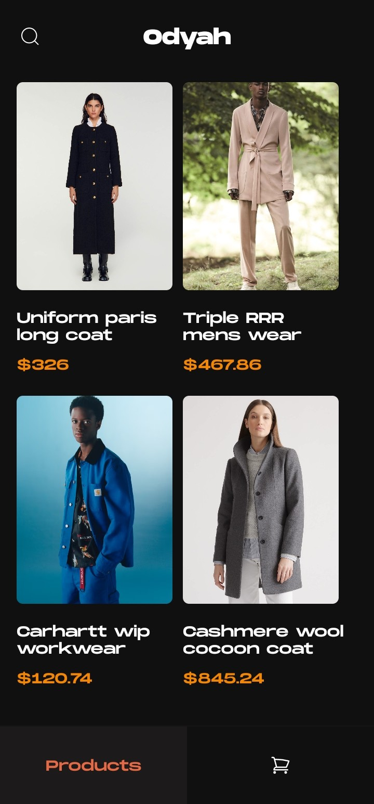
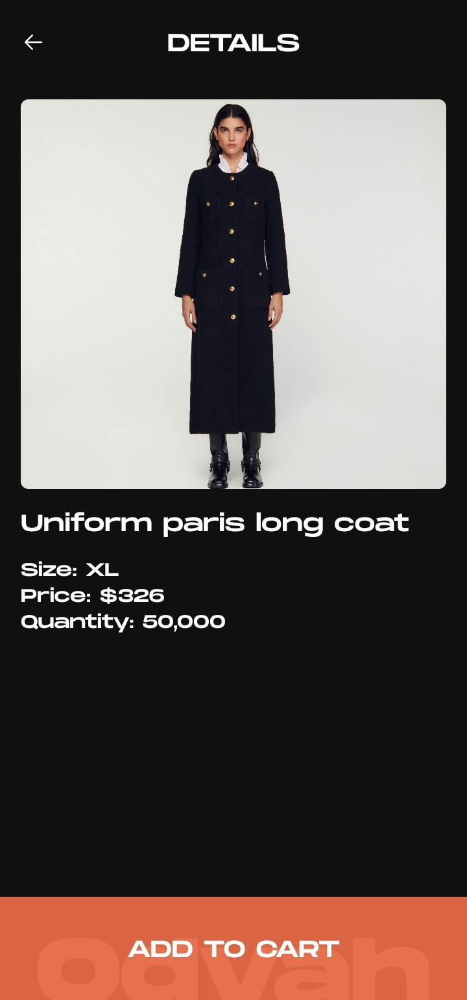
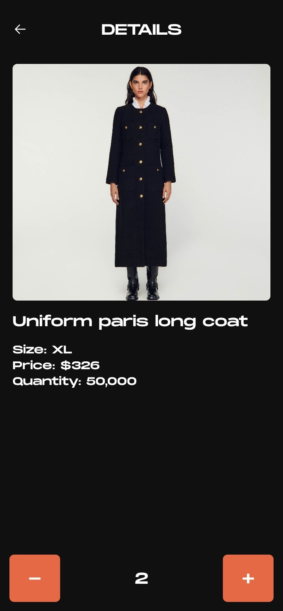
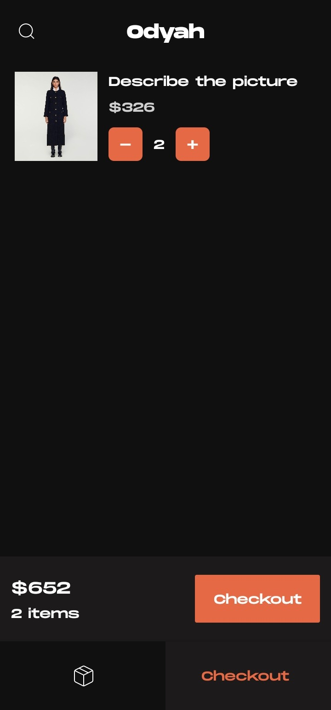

# Odyah 

## Description
An e-commerce shopping app built to serve the public with the needs for wears of ny type and material e.g cashmere, cotton e.t.c.

## Technologies
This app was built using 
- Node.js
- Expo CLI
- React Native Expo
- useContext API (for state management)

## Installation 
1. Clone the repository

```sh
git clone https://github.com/EmmanuelOMoiya/shopping-app
```

2. Install Dependencies

```sh
npm install
```

3. Start the Expo Server

```sh
npx expo start
```

## Running on a Device/Simulator
1. Download the Expo Go app on your iOS or Android device.
2. Scan the QR code generated by `npx expo start`  with the Expo Go app.

## Screenshots

Home Screen

Product Details

Product Details added to cart

Cart / Checkout Screen

Order Success

> Check out this [link](https://appetize.io/app/b_6x6i6wztqysnypy6xo6fnrbarq) for the live preview of Odyah App


## APK Download Link
Download the apk from here [Odyah App](https://expo.dev/artifacts/eas/5RTgxb6SphLDwkMGqB9KXW.apk)